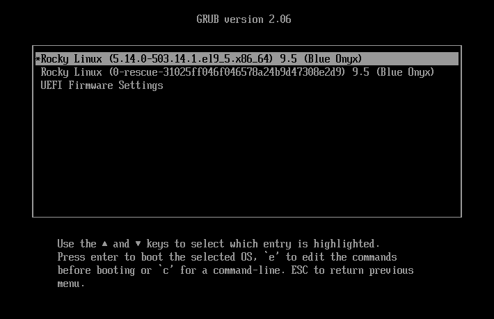
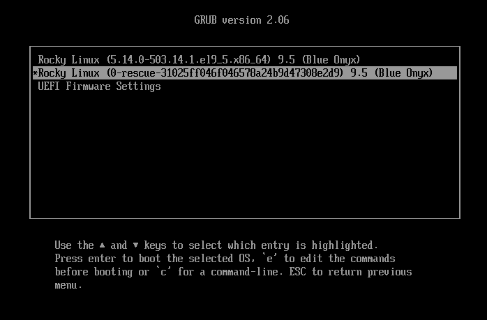
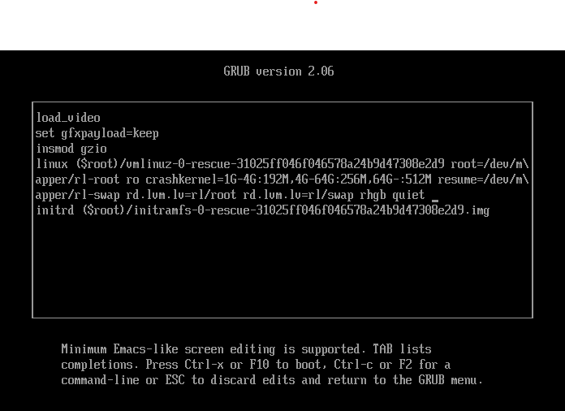

# RHCSA Exam Notes - Version 0.1

## 1. Understand and Use Essential Tools

### Access a shell prompt and issue commands with correct syntax.
### Use input-output redirection (`>`, `>>`, `|`, `2>`, etc.).
### Use `grep` and regular expressions to analyze text.

### Access remote systems using SSH.
1. Install openssh-server:
```bash
sudo dnf install openssh-server
```
2. start and enable openssh-server:
```bash
sudo systemctl enable --now sshd
```
3. Install openssh-clients
```bash
sudo dnf install -y openssh-clients
```
4. Login over ssh
```bash
ssh <username>@<IP_address_or_hostname>
```
5. If ssh is running on a different port:
```bash
ssh -p <port_number> <username>@<IP_address_or_hostname>
``` 
### Log in and switch users in multiuser targets.
1. Verify system is running in the multi-user level of operation.
```bash
systemctl get-default
```

2. If system not in multi-user runlevel, run the following and reboot system:
```bash
systemctl set-default multi-user
```

```bash
reboot
```

3. Try logging in as root:
```bash
su -
```

4. Try logging in as another user:
```bash
su - <username>
```
 
### Archive, compress, unpack, and uncompress files using `tar`, `gzip`, and `bzip2`.
#### Archive with tar


### Create and edit text files.
#### Create text files
- Create text files using the touch command:
```bash
touch <file_name>
```

- Create file using shell redirection
```bash
echo "working" > <text_file_name>
```

#### Edit text files
- Open and edit text file nano, a text editior:
```bash
nano <text_file>
```

### Create, delete, copy, and move files and directories.

#### Create directories
- Create directory in the current working directory using defualt permissions:
```bash
mkdir <directory_name>
```

- Create directory in custom location using defualt permissions:
```bash
mkdir -p /home/user1/Documents/<directory_name>
```

- Create directory in custom location with custom permissions:
```bash
mkdir -m 775 /path/for/direcory/<directory_name>
```
#### Delete directory
- Delete empty directory:
```bash
rmdir <dirctory_name>
```
- Delete non-empty directory:
```bash
rm -rf <directory_name>
```
### Create hard and soft links.
#### Create hard links
```bash
ln <original_filename> <link_name>
```

#### Create soft links
```bash
ln -s <original_filename> <link_name>
```

### List, set, and change standard `ugo/rwx` permissions.

The command use to change a file's permissions is ==chmod==.
| Category | Meaning |
|--------|-------------|
|u | User (owner)|
|g | Group|
|o | Others|
|a | All (user + group + others)|

| Permission | Meaning|
|------------|--------|
|r | Read|
|w | Write|
|x | Execute|
|+ | Add permission|
|- | Remove permissions
|= | set exact permissions|

#### List standard permissions
- List files in current directory:
```bash
ls -l
```
- List files in a directory in another path:
```bash
ls -l /path/to/directory
```
- List files, including hidden files, in current directory:
```bash
ls -la /path/to/directory
```

#### Set standard permissions

```bash
chmod u=<permissions>, g=<permissions>, o=<permissions> <filename>
```

#### Add permissions
```bash
chmod <cateory>+<permissions> <filename>
```
- **Example:** 
- Give the group owner read permissions to random_file.txt
```bash
chmod g+r random_file.txt
```

#### Remove permissions
```bash
chmod <category>-<permissions> <filename>
```
- **Example:**
- Remove the exicute permissions for others
```bash
chmod o-e random_file.txt
```

### Locate, read, and use system documentation (`man`, `info`, `/usr/share/doc`).

## 2. Create Simple Shell Scripts

### Conditionally execute code (`if`, `test`, `[]`, etc.).
### Use looping constructs (`for`, etc.) to process file/command line input.
### Process script inputs (`$1`, `$2`, etc.).
### Process output of shell commands within a script.

## 3. Operate Running Systems

### Boot, reboot, and shut down a system normally.

#### Reboot system
- Reboot system with ```shutdown``` command
```bash
sudo shutdown -r now
```
- Reboot system with ```systemctl``` command
```bash
sudo systemctl reboot
```

#### shut down system
- Shutdown system at a persific time.
```bash
sudo shutdown --halt HH:MM
```

- Cancel a schedule shutdown:
```bash
sudo shutdown -c
```

### Boot systems into different targets manually.
### Interrupt the boot process to gain access to a system.

1. Reboot system
2. Access the GRUB menu

3. Edit boot parameters

- Highlight the kenel that has the word ==rescure== in it, then press the letter e to edit boot parameters.
4. Modidy the kernel boot line

- Move the cursor to the beginning of the line start with the ==linux==, then press Ctrl + e to move to the end of that line.
- Append   ```rb.break``` at the end of that line.
5. Boot the system
- Press Ctrl+x to boot with modified parameters.
- After system reboots, you should be logged into the emergency root shell.
7. Mount the root filesystem
- Run ```mount -o remount,rw /sysroot``` to remount the file system.
8. Change enviroment to the sysroot file system we remounted: ```chroot /sysroot```
9. Reset the password
- Enter the ```passwd``` command, then you will be prompted to change the root password.
9. Re-label SELinux
- Run ```touch /.autorelabel``` to relabel SELinux.
10. Exit and reboot
- Press Ctrl+d twice to exit chroot environment and reboot system.

### Identify CPU/memory intensive processes and kill processes.
####
- Identify cpu/memory intensive processes by running the command ```top```:
```bash
top
```
- To kill a process use the ```kill``` command:
```bash
kill <pid>
```

### Adjust process scheduling.
### Manage tuning profiles.
### Locate and interpret system log files and journals.
### Preserve system journals.
### Start, stop, and check the status of network services.
### Securely transfer files between systems.

## 4. Configure Local Storage

### List, create, delete partitions on MBR and GPT disks.

#### MBR partition
- List all partions
```bash
fdisk -l
```

##### Create a new MBR partition table
- Enter the following command and then type ```o```:
```bash
sudo fdisk <drive>
```

##### Create new MBR partition
1. Enter the following command:
```bash
sudo fdisk <drive>
```

2. Type ```n``` and press enter to create a new partition
3. Choose ```p``` for a primary partition (MBR supports up to 4 primary partitons)
4. Specify the partition number (1-4)
5. Choose the first and last sectors (default values are usually fine).
6. After creating the partition, type ```w``` to write the changes.

##### Delete MBR partition
1. Enter the following command:
```bash
sudo fdisk <drive>
```
2. Type ```d``` to delete a partition.
3. Enter the partition number to delete.
4. Type w to write the changes.

- To create an MBR partition use ```fdisk```
#### GPT partition:
##### List Partitions
- To list all partitions of a drive 
```bash
sudo gdisk -l <drive>
```

##### Create a new GPT partition table
1. Enter the following command:
```bash
sudo gdisk <drive>
```

2. Type ```n``` and press enter to create a new partition
3. Specify the partition number (1-4)
4. Choose the first and last sectors (default values are usually fine).
5. Choose the partition type (e.g., 8300 for Linux filesystems or another type as needed).
6. After creating the partition, type ```w``` to write the changes.

##### Delete GPT partition
1. Enter the following command:
```bash
sudo gdisk <drive>
```
2. Type ```d``` to delete a partition.
3. Enter the partition number to delete.
4. Type ```w``` to write the changes.

### Create and remove physical volumes.
#### Create physical volumes
1. Install LVM Tools (if not installed)
```bash
sudo dnf install lvm2
```
2. Identify the Disk or Partition
```bash
lsblk
```
3. Create the Physical Volume
```bash
sudo pvcreate <drive>
```
4. Verify the Physical Volume
```bash
sudo pvdisplay
```

### Assign physical volumes to volume groups.
### Create and delete logical volumes.
### Configure systems to mount file systems at boot (UUID or label).
### Add new partitions and logical volumes, and swap to a system non-destructively.

## 5. Create and Configure File Systems

- Create, mount, unmount, and use `vfat`, `ext4`, and `xfs` file systems.
- Mount and unmount network file systems using NFS.
- Configure autofs.
- Extend existing logical volumes.
- Create and configure set-GID directories for collaboration.
- Diagnose and correct file permission problems.

## 6. Deploy, Configure, and Maintain Systems

### Schedule tasks using `at` and `cron`.
#### Schedule tasks using `at`
1. install `at`
```bash
sudo dnf install at
```
2. Start and enable the atd service
```bash
sudo systemctl start atd
sudo systemctl enable atd
```
3. Schedule a task
```bash
at <time>
```
4.  After entering an interactive shell, enter a command you want to run at the time you specified
```bash
echo "Hello, World!" > /home/username/hello.txt
```
##### ```at``` Time Formats:
| **Time Format**              | **Example**                 | **Description**                                                        |
|------------------------------|-----------------------------|------------------------------------------------------------------------|
| **Specific time (24-hour format)** | `at 14:30`                | Runs the task at 2:30 PM (24-hour format).                             |
| **Specific time (12-hour format)** | `at 2:30 PM`              | Runs the task at 2:30 PM (12-hour format).                             |
| **Time tomorrow**            | `at 3:00 PM tomorrow`       | Runs the task at 3:00 PM on the next day.                              |
| **Time in the future (relative)** | `at now + 5 minutes`       | Runs the task 5 minutes from the current time.                         |
| **Time in the future (relative)** | `at now + 2 hours`        | Runs the task 2 hours from the current time.                           |
| **Time in the future (relative)** | `at now + 1 day`          | Runs the task 1 day from the current time.                             |
| **Specific date and time**    | `at 4:30 PM 2025-03-23`     | Runs the task on March 23, 2025 at 4:30 PM.                            |
| **Specific weekday**          | `at 10:00 AM Monday`        | Runs the task at 10:00 AM on the next Monday.                          |
| **Today at a specific time**  | `at 6:00 AM today`          | Runs the task at 6:00 AM today (if the current time is before 6:00 AM).|
| **Next weekday at a specific time** | `at 7:00 PM Friday`    | Runs the task at 7:00 PM on the next Friday.                           |
| **Weekday shorthand**         | `at 9:00 AM Mon`            | Runs the task at 9:00 AM on the next Monday (abbreviated weekday).     |
| **Current time**              | `at now`                    | Runs the task immediately (or very shortly after).                     |
| **Midnight**                  | `at midnight`               | Runs the task at midnight.                                             |
| **Noon**                      | `at noon`                   | Runs the task at noon.                                                 |

#### Schedule task with ```cron```
1. Edit the crontab: Use crontab -e to open the cron job editor for the current user.
2. Cron syntax:
A cron job has the format:

```* * * * * /path/to/command```

- Minute (0-59)
- Hour (0-23)
- Day of the month (1-31)
- Month (1-12)
- Day of the week (0-6, Sunday=0)

3. Example: To run a command at 2:00 AM every day:
```bash
0 2 * * * /path/to/command
```

4. Save and exit:
After adding your cron job, save and exit the editor (Ctrl+X for nano, :wq for vi).

5. View existing cron jobs:
Use crontab -l to list all scheduled cron jobs.

- Start and stop services, configure automatic boot services.
- Configure systems to boot into a specific target automatically.
- Configure time service clients.
- Install and update software packages from Red Hat Network, a remote repository, or from local file system.
- Modify the system bootloader.

## 7. Manage Basic Networking

### Configure IPv4 and IPv6 addresses

#### Configure IPv4 Address

- List all connections to find what connection you want to configure:
```bash
nmcli connection show
```

- Configure IP address for selected connection:
```bash
nmcli connection modify <connection_name> ipv4.addresses <ipv4_address>/<subnet_prefix>
```

- Configure the gateway for selected connection:
```bash
nmcli connection modify <connection_name> ipv4.gateway <gateway_ip>
```

- Configure the method for selected connection to manual for a static IP:
```bash
nmcli connection modify <connection_name> ipv4.method manual
```

#### Configure IPv6 Address

- List all connections to find what connection you want to configure:
```bash
nmcli connection show
```

- Configure IP address for selected connection:
```bash
nmcli connection modify <connection_name> ipv6.addresses <ipv6_address>/<subnet_prefix>
```

- Configure the gateway for selected connection:
```bash
nmcli connection modify <connection_name> ipv6.gateway <gateway_ip>
```

- Configure the method for selected connection to manual for a static IP:
```bash
nmcli connection modify <connection_name> ipv6.method manual
```

#### Apply Changes

- Apply changes by bringing the connection down and up again:
```bash
nmcli connection down <connection_name>
nmcli connection up <connection_name>
```

#### Verify the Configuration

- Verify the IP configuration:
```bash
ip addr show
```

- Alternatively, using `nmcli`:
```bash
nmcli connection show <connection_name>
```

- Configure hostname resolution.
- Configure network services to start automatically at boot.
- Restrict network access using `firewall-cmd/firewalld`.

## 8. Manage Users and Groups

### Create, delete, and modify local user accounts.
#### Create local user account
- Create User:
```bash
useradd <username>
```
- Create User password:
```bash
passwd <username>
```

#### Delete local user account
- Delete User:
```bash
userdel -r <username>
```

#### Modify User
- Change User's name:
```bash
usermod -l "new_username" <username>
```
### Change passwords and adjust password aging for local user accounts.

#### Change local user password
- Change user's password:
```bash
passwd <username>
```
#### Adjust password aging for local user account
- Adjust passord aging:
```bash
chage -M <number_of_days> <username>
```
### Create, delete, and modify local groups and group memberships.
#### Create local group
- Create local group
```bash
sudo groupadd <group_name>
```
- Create local group with custom ID
```bash
sudo groupadd -g <group_id> <group_name>
```

#### Delete local group
- Delete local group
```bash
sudo groupdel <group_name>
```

#### Modify local groups
- Change a group ID
```bash
groupmod -g <group_id> demo1
```

- Change a group name
```bash
sudo groupmod -n <new_group_name> <group_name>
```
#### Add user to group
- Add user to group
```bash
  sudo usermod -aG <group_name> <user_name>
```

- Confirm change
```bash
id <user_name>
```

#### Remove user from group
- Remove user from group
```bash
sudo gpasswd --delete user1 demo
```
- Confirm change
```bash
id <user_name>
```

### Configure superuser access.

## 9. Manage Security

- Configure firewall settings using `firewall-cmd/firewalld`.
- Manage default file permissions.
- Configure key-based authentication for SSH.
- Set enforcing and permissive modes for SELinux.
- List and identify SELinux file and process contexts.
- Restore default file contexts.
- Manage SELinux port labels.
- Use boolean settings to modify system SELinux settings.
- Diagnose and address routine SELinux policy violations.

## 10. Manage Containers

- Find and retrieve container images from a remote registry.
- Inspect container images.
- Perform container management using commands like `podman` and `skopeo`.
- Perform basic container management (run, start, stop, list containers).
- Run a service inside a container.
- Configure a container to start automatically as a systemd service.
- Attach persistent storage to a container.
